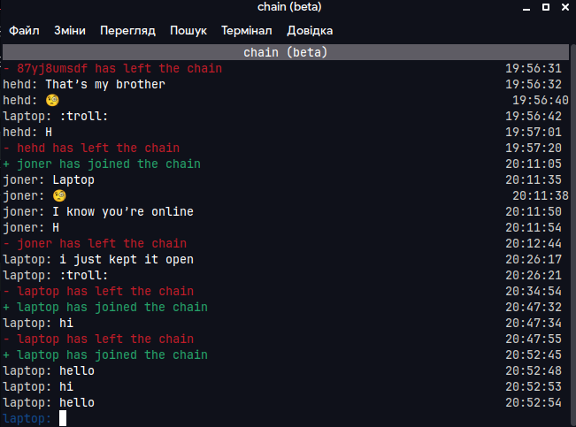

# chain cli
Command line interface for [Chain, a simple chatting app](https://github.com/LaptopCat/chain)


# Installing
## 1. Clone this repository
You can do this using the git CLI (if you have it installed) or just download the zip file on the Code page.

## 2. Install Python and the required dependencies
Then, you need to install the [Python programming language](https://www.python.org/downloads/)

Any version of Python, starting from 3.7 and above will be fine.

After installing Python, you need to install the required dependencies:
```sh
pip install -r requirements.txt
```
##### (you might need to add `python3 -m` before the command or `python -m`) 

# Configuring
## 1. .chain file (optional)
The cli will always try to load configuration from it first. The file must be located in the same directory as the main.py file.

The default .chain file looks like this:
```
chain: wss://chain.laptop-cat.repl.co/w
username: (your username here)
```
The file is already included in the repository.
chain is the instance that the cli will connect to, defaults to official chain instance.
username is the username it will try to connect with.

# Running the cli
You just need to run the `main.py` file with `python` (or `python3`):
```sh
python main.py
```
You can also specify a username as an argument:
```sh
python main.py username
```

# Credits
based on [this repository](https://github.com/andrelaszlo/gevent-chat/)
